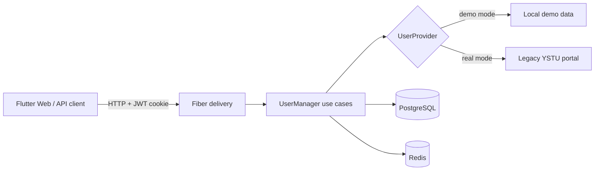

# YstuPortal

[](https://github.com/R0n1ns/YstuPortal/actions/workflows/ci.yml)
[](https://go.dev/)
[](LICENSE)

Backend студенческого портала на Go: авторизация через legacy-сайт ЯГТУ, извлечение профиля и оценок из HTML в Windows-1251, хранение в PostgreSQL и кэширование в Redis.

Проект можно полностью проверить без аккаунта университета: Docker Compose по умолчанию запускает безопасный demo-режим с локальными тестовыми пользователями.

## Что демонстрирует проект

- слоистую архитектуру с явными портами между use case и инфраструктурой;
- интеграцию с внешним stateful-сервисом через HTTP и cookie jar;
- устойчивый парсинг legacy HTML и преобразование Windows-1251 в UTF-8;
- идемпотентное сохранение профиля и оценок в транзакции PostgreSQL;
- Redis cache-aside с TTL;
- JWT в `HttpOnly` cookie, RBAC и rate limiting;
- единый формат ошибок, request ID, CORS, healthcheck и метрики;
- unit-, parser- и integration-тесты с `httptest` и Testcontainers;
- воспроизводимый Docker/CI pipeline с race detector.

## Архитектура



Зависимости направлены внутрь: HTTP, PostgreSQL, Redis и HTML parser реализуют интерфейсы domain/use-case слоя и могут заменяться в тестах.

## Быстрый старт

Требуется Docker Desktop или Docker Engine с Compose.

```bash
cp .env.example .env
docker compose up --build -d
```

После запуска доступны:

- Web UI: http://localhost:8081
- Swagger UI: http://localhost:8080/swagger
- Healthcheck: http://localhost:8080/health/live
- Runtime metrics: http://localhost:8080/metrics

Demo-пользователи:

| Роль | Логин | Пароль |
|---|---|---|
| student | `demo` | `demo123` |
| admin | `demo-admin` | `admin123` |

Пример работы с API:

```bash
curl -i -c cookies.txt \
  -H "Content-Type: application/json" \
  -d '{"login":"demo","password":"demo123"}' \
  http://localhost:8080/api/auth/login

curl -b cookies.txt http://localhost:8080/api/user/info
curl -b cookies.txt http://localhost:8080/api/user/grades
curl -i -b cookies.txt -X POST http://localhost:8080/api/auth/logout
```

Остановка без удаления данных:

```bash
docker compose down
```

Для удаления локального PostgreSQL volume используйте `docker compose down -v`.

## Реальная интеграция с ЯГТУ

Чтобы использовать upstream-портал, установите в `.env`:

```dotenv
DEMO_MODE=false
YSTU_BASE_URL=https://www.ystu.ru
YSTU_PORTAL_CODE=330785001
```

Логин и пароль передаются только внешнему порталу для создания cookie-сессии. Пароль не сохраняется в PostgreSQL, Redis или JWT. Серверная upstream-сессия удаляется при logout и имеет ограниченный TTL.

> Внешний HTML не контролируется этим проектом. Parser изолирован за интерфейсом и покрыт fixture-тестом, поэтому изменения разметки можно исправлять независимо от API и хранения данных.

## Локальная разработка

Требования: Go 1.25, PostgreSQL 16, Redis 7.

```bash
cp .env.example .env
go run ./cmd/migrate -direction up
go run ./cmd/api
```

Основные команды:

```bash
make fmt          # форматирование
make test         # unit + integration tests
make test-race    # тесты с race detector
make cover        # coverage.out + coverage.html
make lint         # golangci-lint
make check        # полный локальный quality gate
```

Интеграционный тест автоматически поднимает PostgreSQL и Redis через Testcontainers. Если Docker недоступен, этот тест пропускается; unit- и parser-тесты продолжают выполняться.

## Структура

```text
cmd/api                     composition root и graceful shutdown
cmd/migrate                 CLI для миграций
internal/config             загрузка и проверка конфигурации
internal/delivery/api       handlers, middleware, DTO, OpenAPI
internal/domain             бизнес-модели, ошибки и порты
internal/logic              use cases и cache-aside
internal/repository         PostgreSQL, Redis, demo и YSTU providers
internal/integration        end-to-end API test с Testcontainers
migrations                  версионируемая схема PostgreSQL
packages/web                собранный Flutter Web client
```

## API и безопасность

- JWT подписывается только HS256 и проверяет issuer, audience и expiration.
- Cookie имеет `HttpOnly`, настраиваемые `Secure`/`SameSite` и единый `Path`.
- Production-конфигурация запрещает стандартный `JWT_SECRET=change-me`.
- API никогда не сериализует пароль или password hash.
- SQL использует параметры pgx; профиль и оценки сохраняются атомарно.
- Внешние запросы используют context, timeout и проверку HTTP status.
- Login endpoint защищён rate limiter.

Единый формат ошибки:

```json
{
  "error": {
    "code": "unauthorized",
    "message": "authentication is required"
  },
  "request_id": "..."
}
```

Полная спецификация находится в [`internal/delivery/api/docs/openapi.yaml`](internal/delivery/api/docs/openapi.yaml).

## Технические решения и ограничения

- Redis необязателен: при недоступности кэша приложение продолжает работу через PostgreSQL.
- Авторизация остаётся stateless на уровне JWT; logout удаляет cookie и server-side upstream session, но не ведёт blacklist уже выпущенных токенов.
- Runtime metrics сейчас представлены компактным JSON endpoint. Для production-развёртывания следующим шагом будет Prometheus exporter.
- `packages/web` содержит готовый build Flutter-клиента; основной предмет этого репозитория — Go backend.

## Roadmap

- Prometheus/OpenTelemetry и structured logging;
- readiness probe с проверкой PostgreSQL и Redis;
- защита Redis cache miss от stampede;
- контрактные тесты OpenAPI;
- отдельный репозиторий исходников Flutter-клиента.

## License

[MIT](LICENSE)
